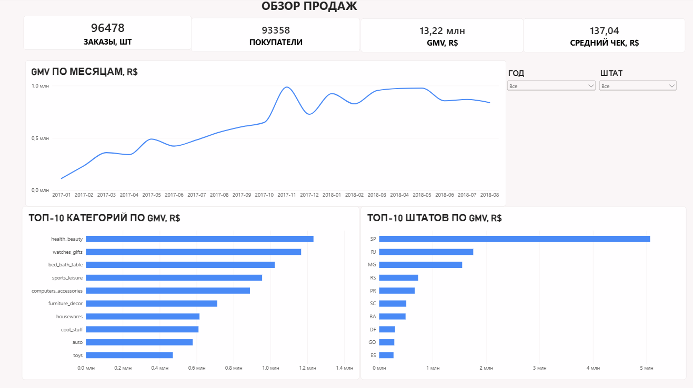
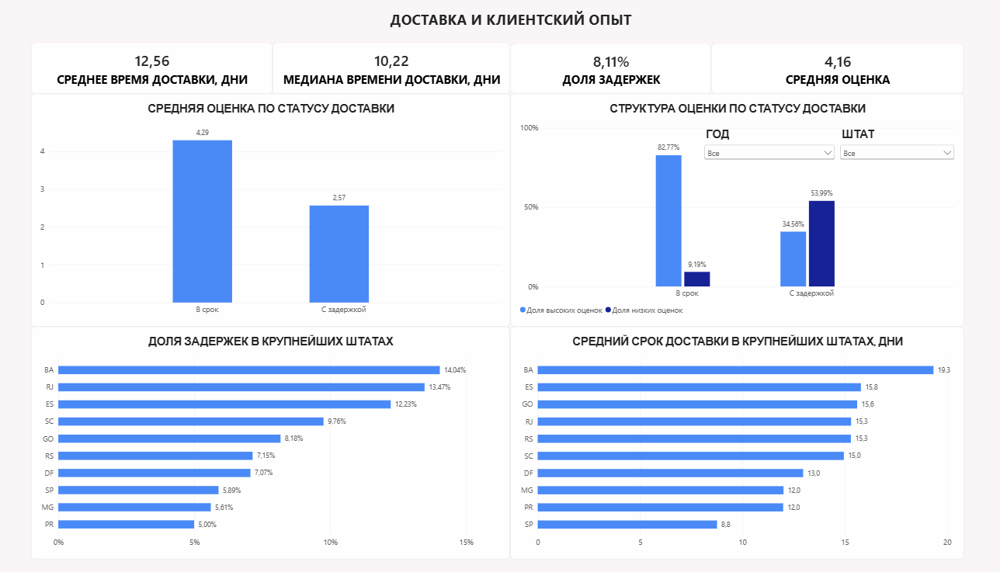

# Olist E-commerce Analysis


Аналитический проект по исследованию продаж, покупателей, доставки и клиентского опыта на основе публичного датасета **Brazilian E-Commerce Public Dataset by Olist**.


Проект выполнен как полноценный аналитический кейс: от загрузки и проверки качества данных до SQL-анализа и интерактивного дашборда в Power BI.


---


## Цель проекта


Проанализировать исторические данные интернет-магазина и ответить на основные бизнес-вопросы:


- как менялись продажи во времени;

- какие товарные категории формируют основной GMV;

- в каких регионах сосредоточены продажи;

- насколько часто покупатели совершают повторные покупки;

- сколько занимает доставка;

- как часто заказы доставляются позже ожидаемой даты;

- как задержки доставки связаны с клиентскими оценками;

- насколько продажи концентрируются среди продавцов.


---


## Инструменты


- **PostgreSQL** — хранение данных и аналитические расчёты

- **DBeaver** — работа с PostgreSQL и SQL

- **SQL** — проверка качества данных и основной анализ

- **Power BI** — модель данных и интерактивный дашборд

- **Power Query** — загрузка и проверка типов данных

- **DAX** — KPI и интерактивные показатели Power BI


---


## Данные


В проекте используются таблицы:


- `orders`

- `order_items`

- `order_payments`

- `order_reviews`

- `customers`

- `products`

- `sellers`

- `geolocation`

- `category_translation`


Период исходных данных:


**04.09.2016 — 17.10.2018**


Сентябрь 2016 и октябрь 2018 представлены неполными месяцами.


Для основного анализа месячной динамики использовался сопоставимый период с полными месяцами.


---


## Основные определения


### Завершённый заказ


Основные показатели продаж рассчитываются только для заказов:


```sql
order_status = 'delivered'
```


### GMV


В проекте используется:


GMV = SUM(order_items.price)


GMV показывает стоимость проданных товаров.


Он не является бухгалтерской выручкой Olist, так как в датасете отсутствуют данные о комиссии маркетплейса.


### Покупатель


Для идентификации реального покупателя используется:


customer_unique_id


### Повторный покупатель


Покупатель считается повторным, если совершил два и более доставленных заказа.


### Средний чек

Средний чек = GMV / количество доставленных заказов

---

## Проверка качества данных

Перед аналитикой была проведена отдельная проверка качества данных.


Проверены:


- количество строк в таблицах;

- уникальность ключей;

- связи между таблицами;

- пропущенные значения;

- числовые аномалии;

- временная логика заказов;

- согласованность заказов и платежей;

- дубли в geolocation;

- наличие отзывов;

- период покрытия данных.


Исходные данные вручную не исправлялись.


Обнаруженные особенности учитывались непосредственно в аналитических запросах.


Полная проверка находится в:


02_data_quality.sql

---

## Результаты анализа

Основные KPI

|Показатель|Значение|
|---|---:|
|Доставленные заказы|96 478|
|Уникальные покупатели|93 358|
|Проданные товарные позиции|110 197|
|GMV|13,22 млн R$|
|Средний чек|137,04 R$|
|Среднее время доставки|12,56 дня|
|Медиана времени доставки|10,22 дня|
|Доля задержанных доставок|8,11%|
|Средняя оценка доставленных заказов|4,16|

### Динамика продаж


В течение 2017 года наблюдается выраженный рост объёма продаж.


Ноябрь 2017 стал крупнейшим месяцем как по количеству доставленных заказов, так и по GMV.


В 2018 году объём продаж стабилизировался примерно на уровне 6–7 тыс. доставленных заказов в месяц.


### Товарные категории


Крупнейшие категории по GMV:

- health_beauty

- watches_gifts

- bed_bath_table

- sports_leisure

- computers_accessories


Категория health_beauty формирует около 9,33% общего GMV.


Топ-5 категорий дают около 39,8% GMV, топ-10 — около 62,4%.


При этом категории формируют GMV по-разному: часть за счёт большого количества проданных товаров, часть — за счёт более высокой средней стоимости позиции.


### Покупатели


Из 93 358 покупателей:


- 90 557 совершили только один доставленный заказ;

- 2 801 совершили два и более заказов.

- Доля повторных покупателей составляет около 3%.


Это показывает преобладание разовых покупок в исторических данных, однако имеющихся данных недостаточно, чтобы определить причины низкой повторяемости.


### География продаж


Крупнейший рынок — штат São Paulo (SP):


40 501 доставленный заказ;

около 38,33% общего GMV.


Три крупнейших штата — SP, RJ и MG — формируют около 63,4% GMV.


Топ-5 штатов дают около 73,9% GMV.


### Доставка


Среднее время доставки:


12,56 дня


Медианное:


10,22 дня


Позже ожидаемой даты доставлено:


8,11% заказов


Сроки доставки заметно отличаются между регионами.


Например, среди крупнейших штатов средний срок доставки составляет примерно:


- BA — 19,3 дня

- ES — 15,8 дня

- GO — 15,6 дня

- RJ — 15,3 дня

- SP — 8,8 дня

### Доставка и клиентский опыт


Одна из наиболее выраженных закономерностей проекта — связь своевременности доставки с оценкой клиента.


Средняя оценка:


|Статус доставки|Средняя оценка|
|---|---:|
|В срок|	4,29|
|С задержкой|	2,57


Структура оценок также значительно отличается.


Структура оценок также значительно отличается.

**Доставлено в срок:**

- оценки 4–5: **82,77%**
- оценки 1–2: **9,19%**

**Доставлено с задержкой:**

- оценки 4–5: **34,56%**
- оценки 1–2: **53,99%**

Таким образом, задержанные заказы связаны с существенно менее благоприятным клиентским опытом.


Данные являются наблюдательными, поэтому эта связь не интерпретируется как доказательство причинно-следственной зависимости.


### Продавцы


В завершённых продажах участвуют 2 970 продавцов.


Доля GMV:


- топ-10 продавцов — 13,27%

- топ-50 — 33,20%

- топ-100 — 45,52%


Продажи не зависят критически от нескольких отдельных продавцов, однако существенная часть GMV сосредоточена среди крупнейших участников маркетплейса.


## Power BI Dashboard


Дашборд состоит из двух страниц.


Обзор продаж 



- Основные KPI, динамика GMV, ведущие товарные категории и регионы.


Доставка и клиентский опыт



- Сроки доставки, задержки, региональные различия и связь доставки с оценками клиентов.


Дашборд поддерживает интерактивную фильтрацию по:


- году;

- штату.


Фильтры синхронизированы между страницами.

---

## Источник данных

Датасет: **Brazilian E-Commerce Public Dataset by Olist**

Источник: [Kaggle — Brazilian E-Commerce Public Dataset by Olist](https://www.kaggle.com/datasets/olistbr/brazilian-ecommerce)

Данные использованы в учебных и демонстрационных целях для анализа продаж, доставки и клиентского опыта в e-commerce.

---


## Структура проекта

```text
olist-ecommerce-analysis/
│
├── README.md
│
├── sql/
│   ├── 01_create_tables.sql
│   ├── 02_data_quality.sql
│   ├── 03_analysis.sql
│   └── 04_powerbi_views.sql
│
├── dashboard/
│   ├── Olist_Ecommerce_Analysis.pbix
│   ├── overview.png
│   └── delivery_customer_experience.png
│
└── data/
```
## Файлы


01_create_tables.sql

Создание структуры таблиц PostgreSQL.


02_data_quality.sql

Проверка качества и согласованности исходных данных.


03_analysis.sql

Основной SQL-анализ и бизнес-выводы.


04_powerbi_views.sql

Аналитические VIEW для модели Power BI.


Olist_Ecommerce_Analysis.pbix

Интерактивный Power BI-отчёт.


## Ограничения анализа


Проект основан на исторических наблюдательных данных.


Поэтому:


- обнаруженные связи не доказывают причинно-следственную зависимость;

- невозможно определить влияние маркетинговых кампаний и рекламных активностей;

- GMV не является чистой выручкой Olist;

- отзыв относится к заказу целиком и не всегда может быть корректно связан с отдельным продавцом или категорией;

- небольшие регионы имеют малое количество заказов, поэтому их показатели менее устойчивы.

## Итог


Анализ показал, что продажи Olist заметно концентрируются в крупнейших регионах и товарных категориях, тогда как база продавцов значительно более распределена.


Одним из наиболее важных наблюдений стала связь качества доставки с клиентским опытом: задержанные заказы имеют значительно более низкие оценки и гораздо большую долю негативных отзывов.


Дополнительного внимания также заслуживает низкая доля повторных покупателей — около 3%.


##Автор: *Анна Лаферова*


Проект выполнен в рамках портфолио Data Analyst.

## Авторские права

© 2026 Анна Лаферова. Все права защищены.

Материалы проекта опубликованы в демонстрационных целях как часть портфолио Data Analyst.

Копирование, распространение, изменение и использование материалов проекта без разрешения автора не допускается.
